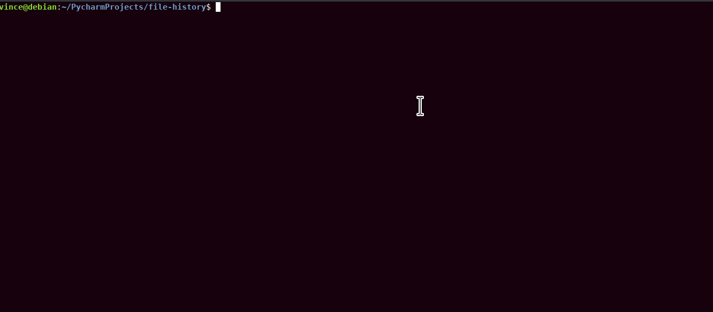
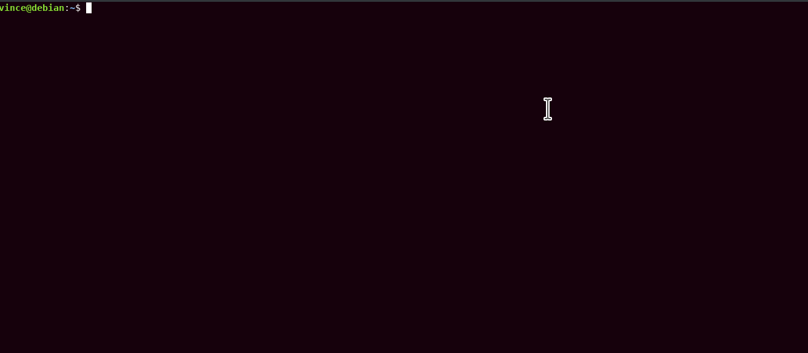

# file-history  
Keeps track of all files operated on in your bash sessions.  
You can show recent files, select one and that file will be opened in editor.  
works in gui and terminal environments and can be installed system wide or only for one user (locally).  

  

## usage:  
- show recent files, lets you select one and open selected in editor  
- ```files```
- show recent files, whos path contains foo and lets you select one and open selected in editor  
- ```files foo```
-  see this for more complex scenrios  
- ```files -h```
   
***env vars with examples***   
Note that some of these are set by the install script in your bashrc  
- which editor to use  
- ```FILE_HIST_EDITOR=vim```  
- how many files to display  
- ```FILE_HIST_RESULTS=25```
- how many files to scan at most
- ```FILE_HIST_MAX_SCANNED=-1```
- where to store the history
- ```FILE_HIST_FILE=/home/user/.file_history```
- gui or terminal mode?
- ```FILE_HIST_MODE=gui```

## installation  
```git clone https://github.com/vincemann/file-history```  
```cd file-history```  
```./install.sh gui|terminal local|system```  
  
## complex usage example:  
This showcases how this tool could be combined using i3.  
You could map a hotkey to executing ```files --action=clip --filter=popup```.  
This way when typing a command and you need a file to complete it, you can simply search for it in a popup and insert it:  

  
  
## how it works  
The install script modifies your bashrc (either ```~/.bashrc``` or ```/etc/bash.bashrc```) and tracks each bash command,
by inserting a debug trap, that is executed each time you type a command.  
The trap then executes a python script, that analyzes the command and current working directory.  
Any files found are added to ```~/.file_history``` or ```/opt/.file_history```, depending on installation scope.  
A backup of you bashrc is stored at ```~/.file-history-backup/```.  
